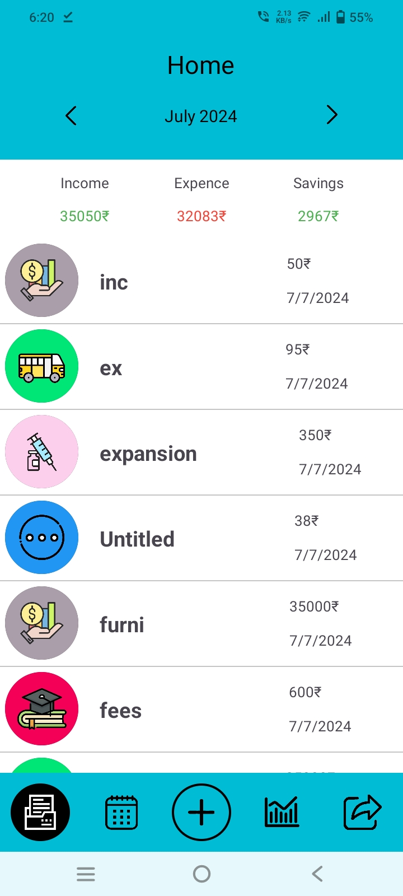
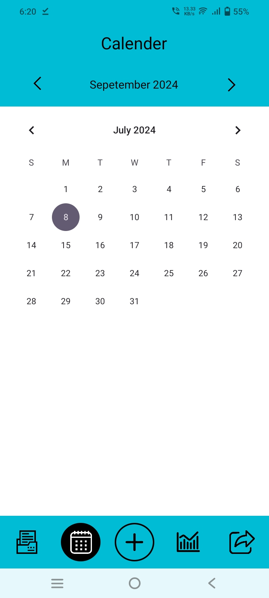
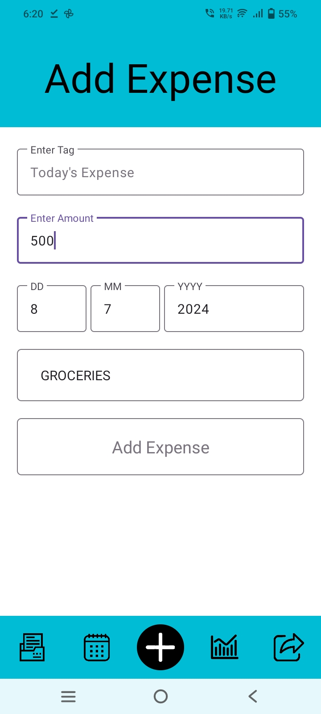
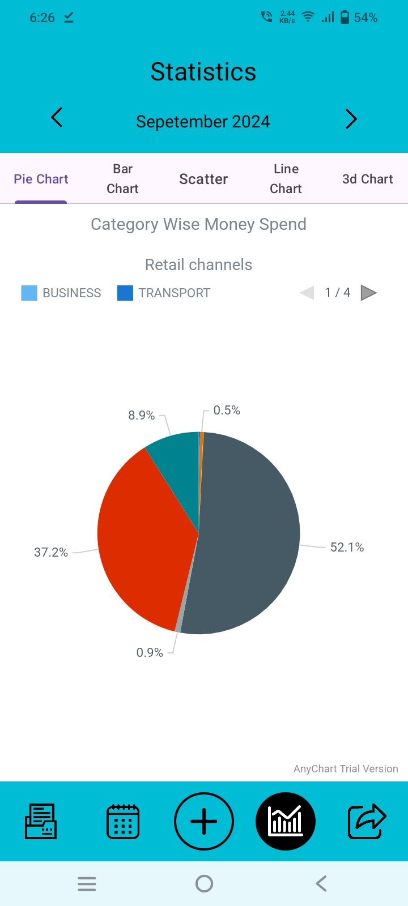
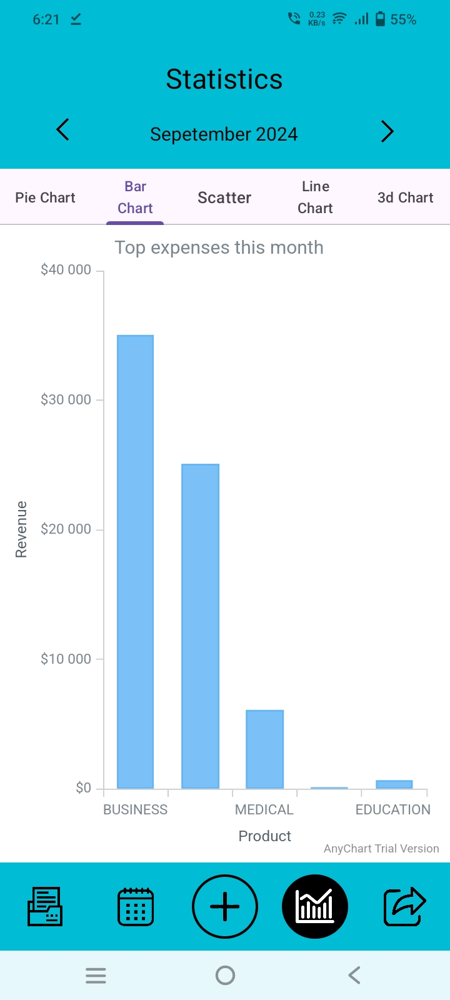

# Expense Manager App

Expense Manager is an Android application that helps users track their expenses efficiently. It provides visual insights into spending habits through various charts and allows easy management of expenses by category and date.

## Features

- **Expense Tracking**: Log expenses with details such as date, category, and amount.
- **Visualization**: View expenses in Pie Chart, Bar Chart, and Scatter Plot formats for better insights.
- **Filter and Sort**: Filter expenses by month and category. Sort expenses by amount or date.
- **User-Friendly Interface**: Simple and intuitive design for easy navigation and usage.

## Technologies Used

- **Android SDK**: Development platform for building the Android application.
- **Java**: Primary programming language used in the app development.
- **AnyChart**: JavaScript library for interactive data visualization.
- **JSON**: Lightweight data-interchange format for storing expense data.

Download the latest version of Expense Manager APK:
- [ExpenseManager.apk](https://github.com/Raahim2/ExpenseManager/blob/main/ExpenseManager.apk)

## Installation

1. Clone the repository:

2. Open the project in Android Studio.

3. Build and run the app on an emulator or Android device.

## Usage

- Launch the app and navigate through tabs to view different charts.
- Tap on a category in the Pie Chart to see details.
- Switch tabs to view Bar Chart, Scatter Plot, etc.
- Use filter options to view expenses for a specific month or category.

## Screenshots

## Statistics

### Monthly Spending Analysis

- **January**: $500
- **February**: $700
- **March**: $400

### Category Distribution

- **Food**: $1200
- **Transportation**: $800
- **Shopping**: $500

## Contributing

Contributions are welcome! Here's how you can contribute to this project:

1. Fork the repository.
2. Create a new branch (`git checkout -b feature/add-new-feature`).
3. Make your changes.
4. Commit your changes (`git commit -am 'Add new feature'`).
5. Push to the branch (`git push origin feature/add-new-feature`).
6. Create a new Pull Request.

Please ensure that your pull request adheres to the project's coding standards and includes tests if applicable.

## License

This project is licensed under the MIT License - see the [LICENSE](LICENSE) file for details.

